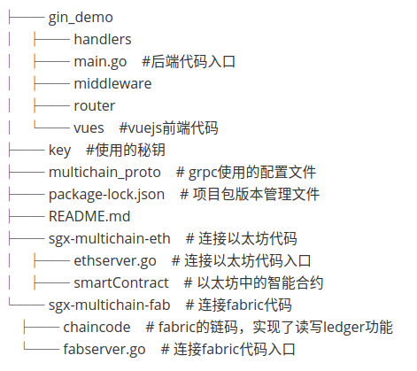

# Multichain项目

* 前端使用vue.js，后端使用go-gin实现
* 使用fabric-sdk-go连接fabricv1.4.3
* 使用golang、rpc连接以太坊私链
* 整个项目使用go版本为1.15，使用go mod进行包管理
* 原项目由于各种原因将后端、调用fabric的部分代码、调用以太坊的部分代码写在了三个文件中，并且使用grpc相互通信，在后续编写中应放入一个文件。

## 项目结构



## 运行流程

1. 在本地启动fabric-samples中的first-network，安装链码 （参考后续博客链接）

2. 在本地启动以太坊私链，并且创建账户、赋予其一定的资产，安装智能合约（参考后续博客链接）

3. 启动前端

   ```
   npm install
   npm run dev
   ```

4. 启动后端以及fabric、以太坊连接器 (后续后端与两个连接器应该是一个东西)

   ```
   cd gin_demo      go run main.go
   cd sgx-multichain-eth      go run ethserver.go
   cd sgx-multichain-fab      go run fabserver.go
   ```

5. 在页面发起事务

## 相关可以参考的博客

1. [vuejs+go-gin搭建项目参考](http://www.webkf.net/article/64/107084.html)
2. [Hyperledger Fabric1.4 安装](https://www.cnblogs.com/zongmin/p/11635686.html)
3. [编译fabric源码并制作docker镜像](https://www.cnblogs.com/gyyyl/p/12624161.html)
4. [fabric-go-sdk demo参考](https://github.com/Shitaibin/fabric-sdk-go-sample)
5. [以太坊私链环境配置以及智能合约使用](https://blog.csdn.net/xun6838/article/details/83721507#t5)


## 其他需要注意的问题

1. fabric中使用的grpc、protobuf版本较低，与go-ethereum以及fabric-sdk-go的protobuf版本有所区别。这会导致后续放在一起编译时由于版本不同、结构不同导致报错，因此需要在使用到这两个包的相应go.mod添加`github.com/golang/protobuf => github.com/golang/protobuf v1.3.3`

2. fabric-sdk-go中使用的config内的各项ip地址、秘钥地址需要与当前使用的fabric网络参数一致，否则无法链接

3. 创世区块配置文件的genesis.json中chainid需要与后续**启动节点**时chainid相同

4. 启动节点时需要在命令最后添加`--allow-insecure-unlock`，否则后续无法调用智能合约

5. 创建用户时需要记录其hash以及key的存储位置，如下面代码中的path，在调用时需要用到：

   ```
   WARN [12-20|15:45:51.989] Please backup your key file!             path=/home/guotiezheng/go/src/github.com/ethereum/ethereum/data/keystore/UTC--2021-12-20T07-45-50.687661441Z--b9522fb91106ba13a9c98f501c02fecefe9f1bb3
   WARN [12-20|15:45:51.989] Please remember your password! 
   "0xb9522fb91106ba13a9c98f501c02fecefe9f1bb3"
   ```
6. 以太坊的后端连接中，需要配置用户的key-path，chainID，pass，contractAddress， fcnName，分别是创建账户时需要存的地址、创世区块中chainID的十六进制、账户密码、合约地址、合约中的函数名称。合约地址在注册合约时可以获得：

   ```
   contract = myContract.new({from: myAddr, data: bin, gas: 1000000})
   contract.address
   ```

## 以太坊较详细的流程

1. 各依赖工具或包等的配置

2. 写入创世区块文件

   ```
   {
       "config": {
           "chainId": 8888,
           "homesteadBlock": 0,
           "daoForkBlock": 0,
           "daoForkSupport": true,
           "eip150Block": 0,
           "eip155Block": 0,
           "eip158Block": 0,
           "byzantiumBlock": 0,
           "constantinopleBlock": 0,
           "petersburgBlock": 0,
           "ethash": {}
       },
       "nonce": "0x42",
       "timestamp": "0x0",
       "extraData": "0x11bbe8db4e347b4e8c937c1c8370e4b5ed33adb3db69cbdb7a38e1e50b1b82fa",
       "gasLimit": "0xffffffff",
       "difficulty": "0x1",
       "alloc": {
           "093f59f1d91017d30d8c2caa78feb5beb0d2cfaf": {
               "balance": "0xffffffffffffffff"
           },
           "ddf7202cbe0aaed1c2d5c4ef05e386501a054406": {
               "balance": "0xffffffffffffffff"
           }
       }
   }
   ```

3. 初始化创世区块

   ```
   geth --datadir data init genesis.json
   ```

4. 启动节点

   ```
   geth --datadir data --networkid 8888 --rpc --rpccorsdomain "*" --nodiscover console --allow-insecure-unlock
   ```

5. 创建新用户，查看余额，挖矿

   ```
    personal.newAccount()
    myAddress = "0xf45fd17e0535d97ab291b91ee3f675d403ca5efb"
    eth.getBalance(myAddress)
   miner.start();admin.sleepBlocks(1);miner.stop()
   ```